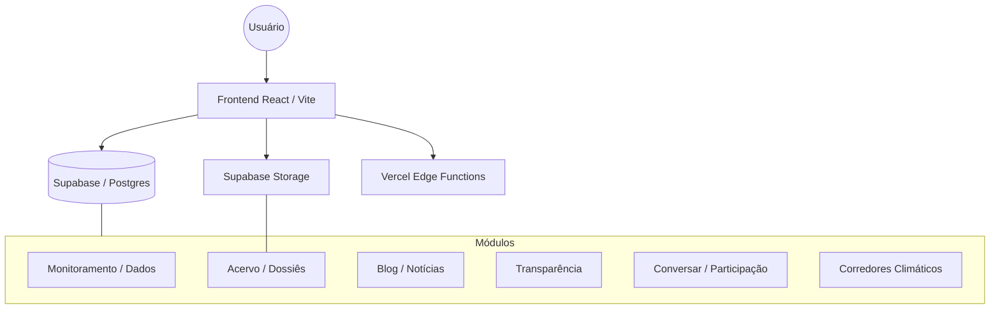

# Relatório Geral do Projeto: SEMEAR Portal
**Data de Emissão:** 04 de Março de 2026
**Status:** Operacional / Pronto para Produção (TWA)

## 1. Visão Geral
O SEMEAR Portal é uma Progressive Web App (PWA) de alta performance focada em monitoramento ambiental e transparência pública. O projeto evoluiu de uma ferramenta de exibição de dados para um ecossistema editorial completo, com suporte a artigos, notícias, dossiês curados e ferramentas de participação direta.

## 2. Arquitetura Funcional
O sistema está estruturado em módulos independentes e resilientes:

### Principais Componentes:
- **Monitoramento**: Dashboard em tempo real com dados de sensores PM2.5/PM10.
- **Acervo Vivo**: Repositório de documentos técnicos, vídeos e fotos com gestão via repositório.
- **Dossiês**: Agrupamentos temáticos de itens do acervo para narrativas curadas.
- **Transparência**: Painel financeiro com integração de auditoria e links oficiais.
- **Conversar**: Módulo de tópicos e comentários para engajamento da comunidade.
- **Corredores**: Mapas editoriais que conectam dados, notícias e acervo em uma narrativa geográfica.

## 3. Avanços Técnicos Recentes (Q1 2026)

### 📱 Preparação Android/TWA
O portal agora está tecnicamente pronto para ser publicado na Google Play Store via **Trusted Web Activity**:
- Manifest otimizado (orientação, categorias, display standalone).
- Infraestrutura `.well-known/assetlinks.json` configurada.
- Reforço de UI: Padding de safe-areas para notches e botão de instalação nativa.
- Documentação completa de empacotamento em `docs/TWA.md`.

### 🖼️ Otimização de Imagens
Implementação de um pipeline moderno de assets:
- **Auto-Resize**: Integração transparente com Supabase Transform API para gerar miniaturas dinâmicas.
- **Lazy Loading**: Aplicado em todas as listagens críticas para reduzir o tempo de carregamento inicial.
- **Tooling**: Script `acervo-upload.mjs` atualizado para gestão editorial de capas.

### 🔍 Busca Global (FTS)
Motor de busca unificado baseado em PostgreSQL Full-Text Search, permitindo encontrar conteúdos em múltiplas tabelas com rankeamento de relevância (`ts_rank`).

### 🛠️ DevOps e Saúde
- **Migration Doctor**: Sistema de diagnóstico para garantir que o banco local e remoto estejam em sincronia.
- **Env Doctor**: Prevenção de conflitos de variáveis de ambiente.
- **Seed de Demo**: Possibilidade de popular o projeto inteiro com dados fictícios para testes em um único comando (`npm run demo:load`).

## 4. Estado Técnico Atual
| Item | Status | Observação |
|---|---|---|
| **Build** | ✅ OK | Sucesso via Vite |
| **Lint** | ✅ OK | Sem erros de tipagem/linting |
| **Banco de Dados** | ✅ Sincronizado | 23 migrações aplicadas |
| **Segurança** | ✅ RLS Ativo | Políticas de acesso configuradas |
| **Performance** | ⚡ Alta | Lazy loading e caching de Edge |

## 5. Próximos Passos Recomendados
1. **Publicação TWA**: Gerar o `.aab` via Bubblewrap e publicar na conta de desenvolvedor Google Play.
2. **Notificações**: Iniciar o envio de alertas de qualidade do ar via o módulo de Push já estruturado.
3. **SEO Intensivo**: Gerar mais links curtos via `/s/*` para aumentar o alcance nas redes sociais.
4. **Automated Testing**: Expandir a cobertura do `npm run smoke` para incluir fluxos críticos de UI.

---
*Gerado automaticamente pelo sistema de diagnóstico SEMEAR.*
